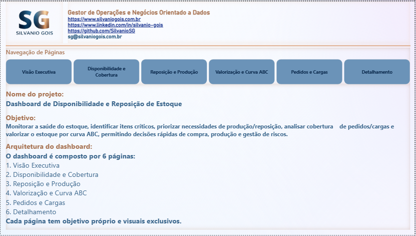
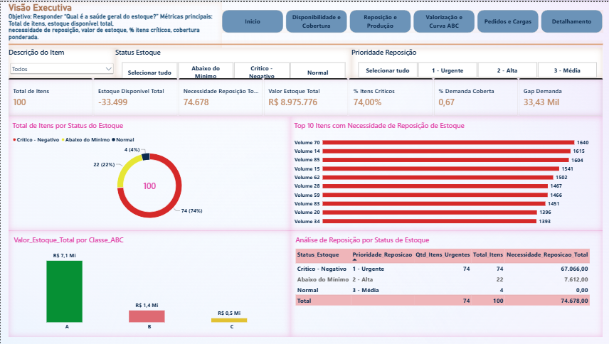
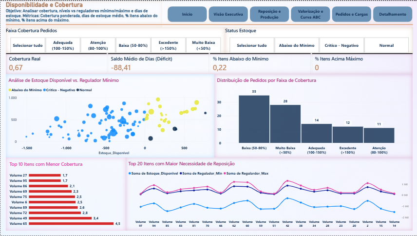
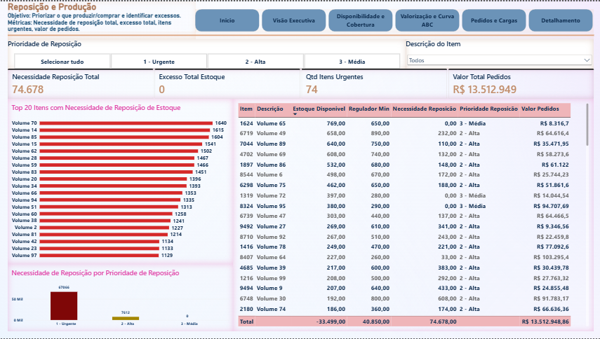
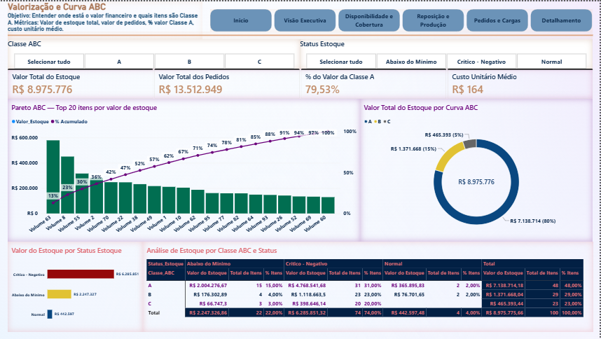
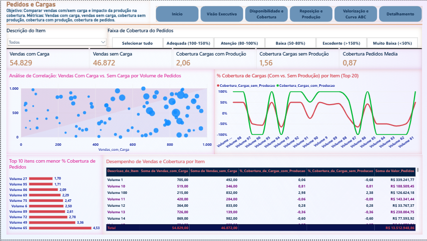
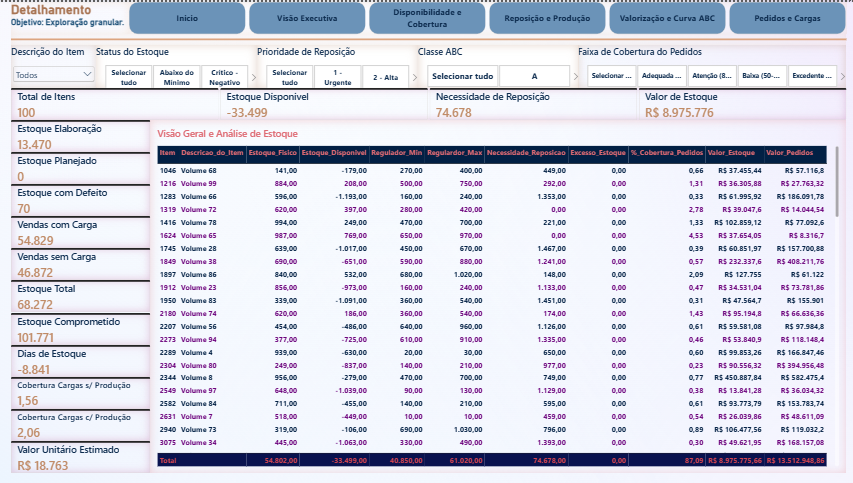

# Dashboard de Disponibilidade e Reposição de Estoque

> **Solução analítica em Power BI para monitoramento da saúde do estoque, priorização de reposição e produção, análise de cobertura de pedidos e valorização financeira por Curva ABC.**

---

## Sumário
- [Visão Geral](#visão-geral)
- [Links do Projeto](#links-do-projeto)
- [Objetivos de Negócio](#objetivos-de-negócio)
- [Estrutura do Dashboard](#estrutura-do-dashboard)
- [Metodologia Técnica](#metodologia-técnica)
- [Insights da Base Analisada](#insights-da-base-analisada)
- [Stack Técnica](#stack-técnica)
- [Estrutura de Arquivos](#estrutura-de-arquivos)
- [Competências Aplicadas](#competências-aplicadas)
- [Como Reproduzir o Projeto](#como-reproduzir-o-projeto)
- [Considerações Finais](#considerações-finais)
- [Contato](#contato)

---

## Visão Geral

Desenvolvido a partir de uma base operacional com 100 itens, este dashboard atua como uma ferramenta centralizada para decisões operacionais e executivas. Ele elimina ruídos de leitura de dados e prioriza gargalos críticos na cadeia de suprimentos e produção.

* **Autor:** Silvanio Gois (*Gestor de Operações e Negócios Orientado a Dados*)
* **Escopo:** 100 itens operacionais
* **Foco:** Decisão executiva e otimização operacional

---

## Links do Projeto

| Recurso | Link |
| :--- | :--- |
| **Dashboard Interativo (Power BI)** | [Acessar Dashboard Publicado](https://app.powerbi.com/view?r=eyJrIjoiMjQwMThiOWQtNTgzMS00NWM2LTg0ODAtZDAzNDFjZjUzYjc4IiwidCI6IjJlYmQyYzU0LWY1ZDMtNGVmYi05ZGE3LWU4Yzk0YmQyMWQzOSJ9) |
| **Website Profissional** | [silvaniogois.com.br](https://www.silvaniogois.com.br) |
| **LinkedIn** | [linkedin.com/in/silvanio-gois](https://www.linkedin.com/in/silvanio-gois/) |
| **GitHub** | [github.com/SilvanioSG](https://github.com/SilvanioSG) |

---

## Objetivos de Negócio

A solução foi projetada para responder centralizadamente às seguintes questões táticas e estratégicas:

1. **Saúde do Estoque:** Qual é a situação geral da disponibilidade dos itens?
2. **Níveis de Alerta:** Quais itens estão críticos, abaixo do mínimo ou acima do máximo?
3. **Priorização:** Quanto e o que deve ser reposto/produzido com urgência?
4. **Impacto Financeiro:** Onde está concentrada a valorização financeira do estoque (Curva ABC)?
5. **Cobertura Operacional:** Como as vendas com e sem carga afetam a cobertura de pedidos?
6. **Ação Operacional:** Como detalhar item a item para execução na ponta?

---

## Estrutura do Dashboard

O relatório conta com 7 páginas organizadas sequencialmente sem duplicidade de métricas ou visuais, em que cada tela alimenta a posterior em uma jornada lógica de navegação.

### Página 0 — Início
Capa de navegação com identidade visual do projeto, contextualização analítica e links diretos para cada área de análise.



---

### Página 1 — Visão Executiva
* **Objetivo:** Responder "Qual é a saúde geral do estoque?" em uma única tela.
* **KPIs Principais:** Total de Itens, Estoque Disponível Total, Necessidade de Reposição Total, Valor de Estoque Total, % de Itens Críticos, % de Demanda Coberta e Gap de Demanda.
* **Análises Entregues:**
  * Distribuição de itens por status de estoque (Donut).
  * Top 10 itens com maior necessidade de reposição (Barras Horizontais).
  * Valor de estoque por Classe ABC (Colunas).
  * Matriz cruzada entre Status de Estoque vs. Prioridade de Reposição.



---

### Página 2 — Disponibilidade e Cobertura
* **Objetivo:** Avaliar o posicionamento do estoque em relação aos reguladores operacionais e dias de cobertura.
* **KPIs Principais:** Cobertura, Dias de Estoque Médio, % de Itens Abaixo do Mínimo, % de Itens Acima do Máximo.
* **Análises Entregues:**
  * Dispersão entre Estoque Disponível vs. Regulador Mínimo.
  * Distribuição de itens por faixa de cobertura de pedidos.
  * Comparativo por item entre Estoque Disponível, Regulador Mínimo e Máximo.
  * Top 10 itens com menor cobertura.



---

### Página 3 — Reposição e Produção
* **Objetivo:** Orientar planos de compra e ordens de produção, apontando também excessos.
* **KPIs Principais:** Necessidade de Reposição Total, Excesso Total de Estoque, Quantidade de Itens Urgentes, Valor Total de Pedidos e Necessidade Líquida.
* **Análises Entregues:**
  * Top 20 itens com maior necessidade de reposição.
  * Distribuição da necessidade de reposição por prioridade (Treemap).
  * Tabela operacional detalhada com itens, reguladores e carteira de pedidos.



---

### Página 4 — Valorização e Curva ABC
* **Objetivo:** Mapear a concentração financeira do estoque e destacar os itens de maior representatividade (Classe A).
* **KPIs Principais:** Valor Total do Estoque, Valor Total dos Pedidos, % do Valor da Classe A e Custo Unitário Médio.
* **Análises Entregues:**
  * Diagrama de Pareto dos 20 itens de maior valor com curva de acumulado.
  * Donut da participação do valor por Classe ABC.
  * Valor de estoque por status operacional.
  * Matriz cruzada entre Classe ABC e Status de Estoque.



---

### Página 5 — Pedidos e Cargas
* **Objetivo:** Medir o comportamento de vendas com/sem carga e o impacto da produção na cobertura.
* **KPIs Principais:** Vendas com Carga, Vendas sem Carga, Cobertura de Cargas com Produção, Cobertura de Cargas sem Produção e Cobertura Média de Pedidos.
* **Análises Entregues:**
  * Dispersão entre Vendas com Carga vs. Vendas sem Carga (tamanho proporcional ao valor de pedidos).
  * Série comparativa de cobertura com e sem produção por item.
  * Top 10 itens com menor cobertura de pedidos.
  * Tabela de desempenho com vendas, coberturas e valor de pedidos.



---

### Página 6 — Detalhamento
* **Objetivo:** Exploração granular e apoio à exportação de dados operacionais.
* **Análises Entregues:**
  * Tabela curada contendo as colunas estratégicas para ação rápida.
  * Formatação condicional em Status, Prioridade e Necessidade de Reposição.
  * Cards contextuais dinâmicos reativos aos filtros aplicados.
  * Slicers multidimensionais (Descrição, Status, Prioridade, Classe ABC, Faixa de Cobertura).
  * *Drillthrough* configurado por Item para navegação aprofundada.



---

## Metodologia Técnica

### 1. Tratamento de Dados (Power Query)
* A base bruta `DisponibilidadeEstoque.xlsx` foi submetida a sanitização avançada:
  * Promoção de cabeçalhos e tipagem explícita de colunas.
  * Substituição de valores nulos por zero em campos numéricos.
  * Criação da dimensão `dItem` via desduplicação de `Item` e `Descricao_do_Item`.
  * Isolamento da tabela fato `fEstoque` mantendo granularidade de 1 registro por item.

### 2. Modelagem de Dados
* **Esquema Estrela (Star Schema):** Relacionamento $1:N$ entre `dItem` e `fEstoque`.
* **Segregação:** Tabela dedicada `_Medidas` para centralização de todas as regras DAX.

### 3. Colunas Calculadas
* **Validação:** `Estoque_Total`, `Estoque_Comprometido` e `Estoque_Disponivel_Calc`.
* **Regras de Negócio:** `Status_Estoque` (4 faixas), `Prioridade_Reposicao` (4 níveis), `Necessidade_Reposicao` e `Excesso_Estoque`.
* **Curva ABC & Categorização:** `Rank_Valor_Estoque`, `Valor_Acumulado_ABC`, `Percentual_Acumulado_ABC`, `Classe_ABC` e `Faixa_Cobertura_Pedidos`.
* **Indexação:** Colunas de ordenação customizada (`Ordem_Status`, `Ordem_Faixa`, `Ordem_Prioridade`, `Ordem_Classe_ABC`).

### 4. Medidas DAX
* **Volumetria e Saldo:** Total de itens, itens urgentes, saldos disponíveis e necessidades de reposição.
* **Financeiro:** Valoração total do estoque, carteira de pedidos, custo médio e representatividade da Classe A.
* **Qualidade e Cobertura:** Porcentagem de itens em faixas críticas e métricas de cobertura recalculadas.
* **Pareto Dinâmico:** Acumulado de Curva ABC ajustado dinamicamente ao contexto de filtro ativo (*Top N* visível).

### 5. Decisões Analíticas Relevantes
* **Substituição de Atributo Redundante:** A coluna original `Produzir` foi descontinuada por redundância. Foi implementada a medida `Necessidade_Reposicao`, alinhada ao regulador mínimo de cada item.
* **Reformulação da Cobertura:** A razão direta entre estoque disponível e vendas gerava percentuais negativos. A métrica foi reestruturada para a relação $\frac{\text{Estoque Total}}{\text{Vendas}}$, permitindo interpretação percentual positiva e comparável.
* **Parâmetros da Curva ABC:** Parâmetros de corte definidos em $80\%$ (Classe A), $95\%$ (Classe B) e $100\%$ (Classe C).
* **Curadoria do Detalhamento:** Seleção estrita de atributos relevantes para evitar o formato de planilha dentro do dashboard.

---

## Insights da Base Analisada

A análise sobre os 100 itens diagnosticou um **déficit sistêmico de estoque**:

* **Risco Operacional Elevado:** $74\%$ dos itens estão em nível **Crítico-Negativo** (saldo indisponível para cobrir pedidos já comprometidos).
* **Déficit Físico:** Saldo disponível total negativo em $-33.499$ unidades, contra uma necessidade de reposição de $74.678$ unidades.
* **Cobertura Restrita:** Apenas $67\%$ da demanda atual possui lastro imediato em estoque.
* **Ausência de Excesso:** $0\%$ dos itens identificados acima do regulador máximo.
* **Concentração Financeira:** $48\%$ dos itens representam $80\%$ do valor do estoque (Classe A). A maior parte desse valor está retida em itens em estado crítico.
* **Dependência Logística:** As vendas com carga superam as vendas sem carga em aproximadamente $17\%$.
* **Pressão Comercial:** A carteira de pedidos soma **R\$ 13,5 milhões**, superando em mais de $50\%$ o valor atual em estoque (**R\$ 8,9 milhões**).

---

## Stack Técnica

* **Power BI Desktop:** Modelagem de dados, desenvolvimento DAX e composição de visuais.
* **Power Query (M):** Extração, transformação e limpeza de dados (ETL).
* **DAX:** Inteligência de dados, cálculo de indicadores e Curva ABC dinâmica.
* **Microsoft Excel:** Base operacional de entrada.
* **PDF:** Documentação e visualização estática do relatório.

---

## Estrutura de Arquivos

```text
.
├── DisponibilidadeEstoque.xlsx
├── DashboardDeDisponibilidade&ReposicaoDeEstoque.pbix
├── DashboardDeDisponibilidade&ReposicaoDeEstoque.pdf
├── pagina0.png
├── pagina1.png
├── pagina2.png
├── pagina3.png
├── pagina4.png
├── pagina5.png
├── pagina6.png
└── README.md
```

| Arquivo | Descrição |
| :--- | :--- |
| `DisponibilidadeEstoque.xlsx` | Base de dados operacional de entrada (100 itens, 18 colunas). |
| `DashboardDeDisponibilidade...pbix` | Arquivo editável do Power BI com modelo, DAX e telas. |
| `DashboardDeDisponibilidade...pdf` | Exportação do relatório em formato PDF estático. |
| `pagina0.png` a `pagina6.png` | Capturas de tela das páginas do dashboard. |
| `README.md` | Documentação técnica e analítica consolidada. |

---

## Competências Aplicadas

* **Engenharia de Dados:** Extração, sanitização, tipagem e modelagem em Star Schema.
* **Modelagem Analítica:** Criação de colunas calculadas, medidas DAX e classificação por Curva ABC.
* **Storytelling Executivo:** Organização de perguntas de negócio em fluxo contínuo de visualização.
* **Design Analítico:** Hierarquia visual, formatação condicional estratégica e navegabilidade UX.
* **Gestão de Estoque:** Leitura de reguladores (mínimo/máximo), cobertura e priorização de ordens.
* **Análise Crítica:** Identificação e correção de métricas distorcidas.
* **Documentação Técnica:** Versionamento completo e publicação de manual estruturado.

---

## Como Reproduzir o Projeto

1. Clone o repositório para o seu ambiente local:
   ```bash
   git clone https://github.com/SilvanioSG/seu-repositorio.git
   ```
2. Abra o arquivo `DashboardDeDisponibilidade&ReposicaoDeEstoque.pbix` no **Power BI Desktop**.
3. Atualize a fonte de dados acessando:
   `Transformar Dados` > `Configurações da Fonte de Dados` e aponte para a localização do arquivo `DisponibilidadeEstoque.xlsx`.
4. Clique em **Atualizar** na aba *Página Inicial*.
5. (Opcional) Publique no Power BI Service e ajuste os links de navegação.

---

## Considerações Finais

O dashboard foi projetado para consumo progressivo: inicia com a visão executiva de alto nível, avança por análises táticas de cobertura, reposição, valorização e logística de cargas, e culmina na operacionalização granular do detalhamento. 

A base analisada aponta um cenário de déficit severo com alta concentração de valor em itens críticos. A ferramenta entrega ao gestor a visibilidade necessária para priorizar recursos de compra e produção com base em dados acionáveis.

---

## Contato

**Silvanio Gois** — *Gestor de Operações e Negócios Orientado a Dados*

* **E-mail:** sg@silvaniogois.com.br
* **Website:** [silvaniogois.com.br](https://www.silvaniogois.com.br)
* **LinkedIn:** [linkedin.com/in/silvanio-gois](https://www.linkedin.com/in/silvanio-gois/)
* **GitHub:** [github.com/SilvanioSG](https://github.com/SilvanioSG)